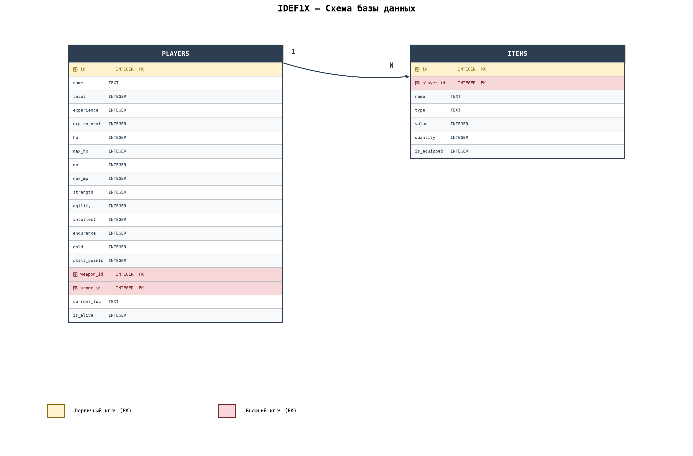
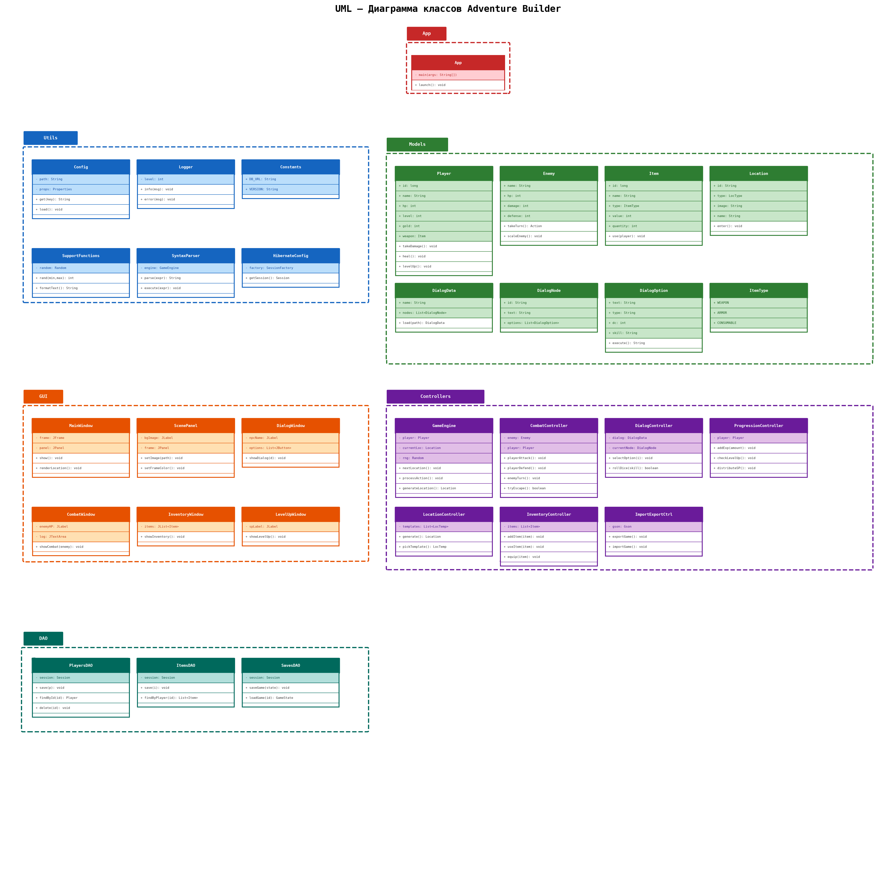

# Структура приложения ***Adventure Builder***

***

## Содержание

- [Содержание](#содержание)
- [1 - Функциональные возможности приложения](#1---функциональные-возможности-приложения)
- [2 - Выбор архитектуры приложения](#2---выбор-архитектуры-приложения)
- [3 - Выбор языка программирования](#3---выбор-языка-программирования)
- [4 - Технологии хранения данных](#4---технологии-хранения-данных)
- [5 - Набор элементов системы](#5---набор-элементов-системы)
- [6 - Схема хранения данных](#6---схема-хранения-данных)
  - [6.1 - locations.json](#61---locationsjson)
  - [6.2 - dialogs.json](#62---dialogsjson)
  - [6.3 - names.json](#63---namesjson)
  - [6.4 - images.json](#64---imagesjson)
  - [6.5 - ambient.json](#65---ambientjson)
  - [6.6 - Формат сохранения (экспорт/импорт)](#66---формат-сохранения-экспортимпорт)
  - [6.7 - Встроенный синтаксис](#67---встроенный-синтаксис)
- [7 - Перечень вспомогательных инструментов](#7---перечень-вспомогательных-инструментов)

***

## 1 - Функциональные возможности приложения

Игра ***Adventure Builder*** — процедурно генерируемая RPG от первого лица, представляющая собой бесконечное путешествие по статичным сценам-локациям с развитием персонажа, пошаговыми боями и диалоговой системой. Приложение поддерживает моддинг через внешние JSON-файлы.

Приложение имеет следующий функционал:

* **Процедурная генерация локаций** — бесконечное путешествие, каждая локация генерируется заново
* **Три типа локаций** — мирные (социальное взаимодействие с NPC), враждебные (пошаговые бои), исследовательские (выбор действий и результатов)
* **Пошаговая боевая система** — выбор действий (атака, защита, предмет, бегство), ИИ врага с четырьмя состояниями (норма, повреждён, агрессия при раненном игроке, бегство при критическом HP)
* **Диалоговая система с тремя механиками** — выбор из вариантов (удачный и неудачные), проверка состояния персонажа, бросок кубика d20 с модификатором навыка
* **Встроенный синтаксис** — компактный мини-язык для описания условий, изменений значений и функций во внешних источниках
* **Система прогрессии** — опыт за успешные действия, очки навыков (SP) при повышении уровня, ручное распределение на характеристики
* **Масштабирование врагов** — частичное отставание уровня врагов от уровня игрока
* **Система предметов** — оружие, броня, расходники; характеристики задаются фиксированно или процедурно (через подстановки)
* **Выбор пути** — навигация через действия в исследовательских локациях (nextFight, nextNPC, nextSearch)
* **Цветовая индикация** — рамка локации отображает тип и уровень опасности
* **Смерть = полный сброс** — хардкорный roguelike-режим без мета-прогрессии
* **Моддинг через JSON** — локации, диалоги, имена, предметы редактируются во внешних файлах
* **Импорт/экспорт игр** — сохранение и загрузка игровых сессй через JSON-файлы
* **Хранение игр в БД** — сохранение текущих игровых сессий внутри приложения через базу данных
* **Графический интерфейс**

***

## 2 - Выбор архитектуры приложения

Так как в приложении обозначена необходимость взаимодействия одного пользователя с одним локальным хранилищем данных (БД + JSON-файлы) и необходимость развёртывания на одной машине, в таком случае подойдёт монолитная архитектура.

Внутри приложения используется разделение на слои:

* **GUI** — графический интерфейс на Swing, отображение сцен, диалогов, боевого интерфейса
* **Controllers** — бизнес-логика: игровой движок, генератор локаций, боевая система, диалоговая система, парсер синтаксиса
* **DAO** — доступ к данным: сохранение/загрузка из БД, импорт/экспорт JSON
* **Models** — модели данных: игрок, враг, предмет, локация, диалог

***

## 3 - Выбор языка программирования

В функциональных требованиях приложения можно чётко выделить бизнес-сущности (игрок, враг, локация, предмет, диалог), потому следует использовать подходящую методологию, в данном случае это ООП (объектно-ориентированное программирование). Приложение должно быть устойчиво к смене среды исполнения (ОС). Для всех этих целей подойдёт язык Java.

***

## 4 - Технологии хранения данных

Хранение информации осуществляется двумя способами:

1. **База данных (SQLite)** — хранение текущих игровых сессий внутри приложения (игроки и предметы)
2. **JSON-файлы** — экспорт/импорт игровых сессий, а также внешний источник данных для моддинга (локации, диалоги, имена, шаблоны предметов)

IDEF1X схема БД:



Сущности и их поля в БД:

1. **players** (игроки)
2. **players.id** (номер игрока, первичный ключ, тип данных long)
3. **players.name** (имя игрока, тип данных text)
4. **players.level** (уровень игрока, тип данных long)
5. **players.experience** (опыт игрока, тип данных long)
6. **players.experience_to_next_level** (опыт, необходимый для следующего уровня, тип данных long)
7. **players.hp** (текущее здоровье игрока, тип данных long)
8. **players.max_hp** (максимальное здоровье игрока, тип данных long)
9. **players.gold** (количество золота, тип данных long)
10. **players.skill_points** (нераспределённые очки навыков, тип данных long)
11. **players.strength** (сила, тип данных long)
12. **players.endurance** (выносливость, тип данных long)
13. **players.agility** (ловкость, тип данных long)
14. **players.intellect** (интеллект, тип данных long)
15. **players.persuasion** (убеждение, тип данных long)
16. **players.intimidation** (запугивание, тип данных long)
17. **players.current_location_id** (идентификатор текущей локации, тип данных text)
18. **players.creation_date** (дата создания игрока, тип данных date)
19. **players.is_alive** (статус: жив/мёртв, тип данных boolean)

20. **items** (предметы)
21. **items.id** (номер предмета, первичный ключ, тип данных long)
22. **items.player_id** (номер игрока-владельца, внешний ключ, тип данных long)
23. **items.name** (название предмета, тип данных text)
24. **items.type** (тип предмета: weapon, armor, consumable, тип данных text)
25. **items.value** (значение предмета: урон для оружия, защита для брони, эффект для расходника, тип данных long)
26. **items.is_equipped** (надет ли предмет, тип данных boolean)
27. **items.creation_date** (дата получения предмета, тип данных date)

***

## 5 - Набор элементов системы

UML схема приложения:



Элементы системы:

1. **App** (точка входа в программу)
2. **Utils** (вспомогательные классы)
3. **Utils.Config** (класс, предоставляющий доступ и реализующий конфигурацию приложения)
4. **Utils.Logger** (класс для журналирования событий приложения)
5. **Utils.Constants** (класс с константами приложения: цвета рамок локаций, формулы масштабирования, базовые DC)
6. **Utils.HibernateConfiguration** (класс, предоставляющий доступ и реализующий конфигурацию БД приложения)
7. **Utils.CustomSQLiteDialect** (класс, реализующий диалект СУБД SQLite для Hibernate)
8. **Models** (модели приложения)
9. **Models.Player** (класс, реализующий игрока: уровень, HP, характеристики, навыки, золото, SP)
10. **Models.Enemy** (класс, реализующий врага: HP, урон, защита, состояние ИИ, масштабирование)
11. **Models.Item** (класс, реализующий предмет: имя, тип, значение, надет/не надет)
12. **Models.LocationTemplate** (класс-шаблон локации: тип, изображение, описание, действия, NPC, враг)
13. **Models.LocationInstance** (класс-экземпляр сгенерированной локации: сгенерированные NPC, враги, предметы)
14. **Models.DialogData** (класс, реализующий структуру диалога: узлы, реплики, варианты ответов)
15. **Models.DialogNode** (класс, реализующий узел диалога: текст, варианты ответов, награды)
16. **Models.DialogOption** (класс, реализующий вариант ответа: тип проверки, целевой узел, DC, навык, условие)
17. **Models.GameState** (перечисление типов состояния: норма, повреждён, агрессия, бегство — для ИИ врага)
18. **GUI** (графический интерфейс приложения)
19. **GUI.MainWindow** (главное окно приложения: меню, выбор игрока, импорт/экспорт)
20. **GUI.ScenePanel** (панель отображения локации: изображение, описание, цветная рамка, кнопки действий)
21. **GUI.CombatPanel** (панель боевого интерфейса: HP игрока/врага, действия боя, лог боя)
22. **GUI.DialogPanel** (панель диалога: текст NPC, варианты ответов, результат проверки)
23. **GUI.InventoryPanel** (панель инвентаря: список предметов, экипировка, использование расходников)
24. **GUI.LevelUpPanel** (панель распределения очков навыков: характеристики, SP, влияние на HP)
25. **GUI.SaveLoadWindow** (окно сохранения/загрузки игры: выбор из БД, импорт/экспорт JSON)
26. **Controllers** (классы с бизнес-логикой приложения)
27. **Controllers.GameEngine** (основной игровой движок: генерация локаций, переходы, прогрессия, смерть)
28. **Controllers.LocationGenerator** (генератор локаций: выбор типа, изображения, наполнение NPC/врагами/предметами)
29. **Controllers.CombatController** (боевая система: ходы, действия игрока и врага, ИИ врага, расчёт урона, награды)
30. **Controllers.DialogController** (диалоговая система: выбор, проверка состояния, бросок кубика, подстановки)
31. **Controllers.SyntaxParser** (парсер встроенного синтаксиса: условия, изменения значений, функции)
32. **Controllers.ItemGenerator** (генератор предметов: процедурные характеристики, имена из внешнего источника)
33. **Controllers.ProgressionController** (прогрессия: опыт, уровни, SP, восстановление HP, масштабирование)
34. **DAO** (классы с логикой доступа к данным)
35. **DAO.PlayerDAO** (класс с логикой доступа к данным игроков в БД)
36. **DAO.ItemDAO** (класс с логикой доступа к данным предметов в БД)
37. **DAO.JsonExporter** (класс экспорта игровых сессий в JSON-файлы)
38. **DAO.JsonImporter** (класс импорта игровых сессий из JSON-файлов)
39. **DAO.ContentLoader** (класс загрузки внешних данных: локации, диалоги, имена из JSON)

***

## 6 - Схема хранения данных

В приложении осуществляется хранение данных о текущих игровых сессиях (игроки и их предметы) в локальной базе данных SQLite. Новые элементы игрового процесса (локации, враги, диалоги, предметы) получаются путём процедурной генерации на основе шаблонов из внешних JSON-файлов.

Имеется поддержка импорта и экспорта сохранений через файлы формата JSON для возможности переноса игровых сессий между устройствами и обмена с другими пользователями.

Все JSON-файлы располагаются в папке `data/` в рабочей директории приложения. Если файл не найден или повреждён, движок выводит сообщение об ошибке в консоль и продолжает работу без данных из этого файла.

Внешние JSON-источники данных:

* **locations.json** — шаблоны локаций трёх типов (мирные, враждебные, исследовательские) с описанием, изображением, действиями, NPC и врагами
* **dialogs.json** — диалоговые деревья с тремя механиками проверок (выбор, состояние, кубик)
* **names.json** — пулы имён для процедурной генерации: имена NPC, названия предметов, названия локаций
* **images.json** — пулы изображений для локаций по типам (необязательный файл)
* **ambient.json** — пулы звуковых дорожек для фонового сопровождения по типам локаций и боевым событиям (необязательный файл)

Встроенный синтаксис внешних источников поддерживает:

* **Условия** — сравнения, логические операторы `and`, `or`, `not` и тернарный оператор: `hp>20 and not hasArmor==1 ? damage3 : tryEscape`
* **Арифметические операции** — сложение `+`, вычитание `-`, умножение `*`, деление `/`, возведение в степень `^`
* **Изменения значений** — арифметическое присваивание: `hp+=10`, `gold-=20`, `exp+=scale20`, `str*=2`, `hp/=2`, `str^=2`
* **Функции** — `randomN`, `damageN`, `healN`, `scaleN`, `scaleRNDN`, `item`, `itemWeapon`, `itemArmor`, `itemConsumable`, `log`, `showMessage`, `setVar`, `inputVar`, `inputNumberVar`, `confirmVar`, `getVar`, `appendVar`, `varEquals`, `varContains`, `stringLength`, `upper`, `lower`, `replace`, `concat`, `trim`, `hasVar`, `removeVar`, `clearInventory`, `removeWeapon`, `removeArmor`, `hasWeapon`, `hasArmor`, `nextFight`, `nextNPC`, `nextSearch`, `nextRandom`, `nextLocation`, `tryEscape`, `death`, `spN`, `goldN`, `expN`
* **Подстановки в тексте** — `{gold}`, `{hp}`, `{maxHp}`, `{level}`, `{inventorySize}`, `{var:name}`, `{item}`, `{char.str}`, `{char.agi}`, `{char.intl}`, `{char.end}`

Подробное описание каждого источника данных и синтаксиса приведено в подразделах ниже.

***

### 6.1 - locations.json

Файл содержит массив шаблонов локаций. Каждый шаблон описывает одну локацию одного из трёх типов: `peaceful` (мирная), `hostile` (враждебная), `exploratory` (исследовательская).

**Общие поля (все типы):**

| Поле | Тип | Описание |
|---|---|---|
| `id` | string | Идентификатор локации (для ссылок) |
| `type` | string | Тип: `peaceful`, `hostile`, `exploratory` |
| `name` | string | Название локации (отображается в интерфейсе) |
| `description` | string | Описание локации (поддерживает подстановки) |
| `image` | string | Путь к изображению относительно `data/` (необязательно; если пусто — берётся из `images.json` по типу) |
| `ambient` | string | Путь к звуковому файлу относительно `data/` (необязательно; если пусто — берётся из `ambient.json` по типу) |
| `auto_transition` | boolean | Разрешает автоматический случайный переход, если событие или действие не задало явную навигацию; по умолчанию `true`. При `false` мирный диалог остаётся на финальном тексте, бой — на экране результата, исследовательское действие остаётся в текущей локации. |

**Дополнительные поля для `peaceful`:**

| Поле | Тип | Описание |
|---|---|---|
| `npc_name` | string | Имя NPC |
| `dialog_id` | string | Идентификатор диалога из `dialogs.json` |
| `on_success` | string | Выражение синтаксиса при успешном диалоге |
| `on_fail` | string | Выражение синтаксиса при провале диалога |

**Дополнительные поля для `hostile`:**

| Поле | Тип | Описание |
|---|---|---|
| `enemy_name` | string | Имя врага |
| `enemy_hp` | int | Базовое HP врага (масштабируется по уровню игрока) |
| `enemy_damage` | int | Базовый урон врага |
| `enemy_defense` | int | Базовая защита врага |
| `on_victory` | string | Выражение синтаксиса при победе |
| `on_defeat` | string | Выражение синтаксиса при поражении |
| `scale_enemy` | boolean | Баланс характеристик противника под игрока |

**Дополнительные поля для `exploratory`:**

| Поле | Тип | Описание |
|---|---|---|
| `actions` | array | Массив действий игрока |

**Структура элемента `actions`:**

| Поле | Тип | Описание |
|---|---|---|
| `text` | string | Текст кнопки действия (поддерживает подстановки) |
| `result` | string | Выражение синтаксиса (выполняется при выборе) |
| `next` | string | Навигация: `nextFight`, `nextNPC`, `nextSearch` или пусто (случайная при `auto_transition: true`; иначе остаётся текущая локация) |

**Пример:**

```json
{
  "locations": [
    {
      "id": "village_01",
      "type": "peaceful",
      "name": "Деревня Орехово",
      "description": "Небольшая деревня у реки. Жители выглядят настороженно. У вас {gold} золота.",
      "image": "images/village.png",
      "ambient": "ambient/village.wav",
      "npc_name": "Старейшина",
      "dialog_id": "village_elder",
      "on_success": "gold+=50; exp+=scale20",
      "on_fail": "hp-=random5"
    },
    {
      "id": "cave_01",
      "type": "hostile",
      "name": "Тёмная пещера",
      "description": "Сырая пещера с запахом гнили. Что-то двигается в темноте.",
      "image": "images/cave.png",
      "ambient": "ambient/cave.wav",
      "enemy_name": "Пещерный гоблин",
      "enemy_hp": 30,
      "enemy_damage": 6,
      "enemy_defense": 2,
      "on_victory": "gold+=random20; exp+=scale30; item",
      "on_defeat": "death"
    },
    {
      "id": "ruins_01",
      "type": "exploratory",
      "name": "Древние руины",
      "description": "Разрушенные стены поросли мхом. В углу виден сундук, а в другом — проход глубже.",
      "image": "images/ruins.png",
      "ambient": "ambient/ruins.wav",
      "actions": [
        {
          "text": "Открыть сундук",
          "result": "gold+=random30; item",
          "next": "nextFight"
        },
        {
          "text": "Идти глубже",
          "result": "hp-=random10",
          "next": "nextSearch"
        },
        {
          "text": "Уйти отсюда",
          "result": "",
          "next": "nextNPC"
        }
      ]
    }
  ]
}
```

***

### 6.2 - dialogs.json

Файл содержит объект, где ключ — идентификатор диалога, значение — структура диалога. Каждый диалог состоит из узлов (`nodes`), а каждый узел содержит варианты ответов (`options`).

**Структура диалога:**

| Поле | Тип | Описание |
|---|---|---|
| `npc_name` | string | Имя NPC (отображается в заголовке) |
| `greeting` | string | Приветствие NPC (необязательно) |
| `nodes` | array | Массив узлов диалога |

**Структура узла (`nodes`):**

| Поле | Тип | Описание |
|---|---|---|
| `id` | string | Идентификатор узла (для ссылок из опций) |
| `text` | string | Текст реплики NPC (поддерживает подстановки) |
| `reward` | string | Выражение синтаксиса (награда, выполняется при переходе на узел) |
| `end_dialog` | boolean | Завершает диалог при переходе на этот узел |
| `trigger_combat` | boolean | Начинает бой при переходе на этот узел |
| `success` | boolean | Успешное завершение диалога (влияет на `on_success` / `on_fail`) |
| `options` | array | Массив вариантов ответа |

**Структура опции (`options`):**

| Поле | Тип | Описание |
|---|---|---|
| `text` | string | Текст варианта ответа (поддерживает подстановки) |
| `type` | string | Тип: `choice` (выбор), `dice` (кубик d20), `condition` (проверка состояния) |
| `next` | string | Целевой узел (для `choice`) |
| `skill` | string | Навык для `dice`: `persuasion` (убеждение = INT) или `intimidation` (запугивание = STR) |
| `dc` | int | Сложность для `dice` (d20 + навык >= DC) |
| `success` | string | Целевой узел при успехе (для `dice` и `condition`) |
| `fail` | string | Целевой узел при провале (для `dice` и `condition`) |
| `check` | string | Условие для `condition` (например `hp>20` или `gold>=100`) |

**Пример:**

```json
{
  "village_elder": {
    "npc_name": "Старейшина",
    "greeting": "Здравствуйте, путник.",
    "nodes": [
      {
        "id": "start",
        "text": "Вы пришли вовремя. В нашей деревне беда — гоблины из пещеры атакуют по ночам. Поможете нам?",
        "options": [
          {
            "text": "Конечно помогу. Что нужно сделать?",
            "type": "choice",
            "next": "accept"
          },
          {
            "text": "Сколько заплатите? [Убеждение]",
            "type": "dice",
            "skill": "persuasion",
            "dc": 12,
            "success": "bribe_success",
            "fail": "bribe_fail"
          },
          {
            "text": "Либо вы платите, либо я ухожу. [Запугивание]",
            "type": "dice",
            "skill": "intimidation",
            "dc": 15,
            "success": "threat_success",
            "fail": "threat_fail"
          },
          {
            "text": "Извините, мне некогда.",
            "type": "choice",
            "next": "leave"
          }
        ]
      },
      {
        "id": "accept",
        "text": "Благодарю! Вот немного золота на дорогу.",
        "reward": "gold+=20; exp+=scale10",
        "end_dialog": true,
        "success": true
      },
      {
        "id": "bribe_success",
        "text": "Хорошо, дам 50 золотых авансом.",
        "reward": "gold+=50",
        "end_dialog": true,
        "success": true
      },
      {
        "id": "bribe_fail",
        "text": "Мы бедная деревня, у нас нет лишнего золота.",
        "end_dialog": true,
        "success": false
      },
      {
        "id": "threat_success",
        "text": "Ладно, ладно! Вот золото, только не сердитесь.",
        "reward": "gold+=30; exp+=scale15",
        "end_dialog": true,
        "success": true
      },
      {
        "id": "threat_fail",
        "text": "Как вы смеете угрожать мне?! Уходите!",
        "end_dialog": true,
        "success": false
      },
      {
        "id": "leave",
        "text": "Понимаю. Будьте осторожны в пути.",
        "end_dialog": true,
        "success": false
      }
    ]
  },
  "merchant": {
    "npc_name": "Торговец",
    "greeting": "Покупай-продавай!",
    "nodes": [
      {
        "id": "start",
        "text": "У меня есть кое-что интересное. Покажешь свой кошелёк?",
        "options": [
          {
            "text": "Сколько стоит? [Проверка золота]",
            "type": "condition",
            "check": "gold>=100",
            "success": "rich",
            "fail": "poor"
          }
        ]
      },
      {
        "id": "rich",
        "text": "О, у вас есть деньги! Вот отличный меч.",
        "reward": "itemWeapon; gold-=100",
        "end_dialog": true,
        "success": true
      },
      {
        "id": "poor",
        "text": "Приходите, когда будет больше золота.",
        "end_dialog": true,
        "success": false
      }
    ]
  }
}
```

***

### 6.3 - names.json

Файл содержит объект, где ключ — имя пула, значение — массив строк. Имена из пулов используются при процедурной генерации: названия предметов, имена врагов, имена NPC.

**Используемые ключи:**

| Ключ | Использование |
|---|---|
| `weapon_names` | Названия оружия при генерации |
| `armor_names` | Названия брони при генерации |
| `consumable_names` | Названия расходников при генерации |
| `npc_names` | Имена NPC (если в локации не задано `npc_name`) |
| `enemy_names` | Имена врагов (если в локации не задано `enemy_name`) |
| `location_names` | Названия локаций (если в шаблоне не задано `name`) |

**Пример:**

```json
{
  "weapon_names": [
    "Ржавый меч",
    "Короткий кинжал",
    "Боевой топор",
    "Длинный лук",
    "Стальной клинок",
    "Кистен",
    "Алебарда"
  ],
  "armor_names": [
    "Кожаный доспех",
    "Железные латы",
    "Кольчуга",
    "Латные перчатки",
    "Деревянный щит"
  ],
  "consumable_names": [
    "Зелье лечения",
    "Хлеб",
    "Сыр",
    "Целебная трава",
    "Эликсир силы"
  ],
  "npc_names": [
    "Алекс",
    "Марина",
    "Борис",
    "Елена",
    "Виктор"
  ],
  "enemy_names": [
    "Гоблин",
    "Скелет",
    "Волк",
    "Бандит",
    "Тролль"
  ]
}
```

***

### 6.4 - images.json

Необязательный файл. Содержит пулы изображений по типам локаций. Если у локации в `locations.json` поле `image` пусто или отсутствует, движок выбирает случайное изображение из пула по типу локации.

**Ключи:**

| Ключ | Использование |
|---|---|
| `peaceful` | Пул изображений для мирных локаций |
| `hostile` | Пул изображений для враждебных локаций |
| `exploratory` | Пул изображений для исследовательских локаций |

Пути в массивах указываются относительно папки `data/`.

**Пример:**

```json
{
  "peaceful": [
    "images/village.png",
    "images/town.png",
    "images/camp.png",
    "images/temple.png"
  ],
  "hostile": [
    "images/cave.png",
    "images/dungeon.png",
    "images/forest_dark.png",
    "images/swamp.png"
  ],
  "exploratory": [
    "images/ruins.png",
    "images/abandoned.png",
    "images/crossroads.png",
    "images/clearing.png"
  ]
}
```

***

### 6.5 - ambient.json

Необязательный файл. Содержит пулы звуковых дорожек для фонового сопровождения. Логика выбора:

1. Если у локации задано поле `ambient` — используется оно
2. Иначе берётся случайный файл из пула по типу локации
3. Для боя используется пул `combat`
4. Для экрана смерти — пул `gameover`

**Ключи:**

| Ключ | Использование |
|---|---|
| `peaceful` | Фоновый звук для мирных локаций |
| `hostile` | Фоновый звук для враждебных локаций |
| `exploratory` | Фоновый звук для исследовательских локаций |
| `combat` | Звук боя |
| `gameover` | Звук экрана смерти |

Пути указываются относительно папки `data/`.

**Пример:**

```json
{
  "peaceful": [
    "ambient/village.wav",
    "ambient/town.wav",
    "ambient/temple.wav"
  ],
  "hostile": [
    "ambient/cave.wav",
    "ambient/dungeon.wav"
  ],
  "exploratory": [
    "ambient/ruins.wav",
    "ambient/forest.wav"
  ],
  "combat": [
    "ambient/combat1.wav",
    "ambient/combat2.wav"
  ],
  "gameover": [
    "ambient/death.wav"
  ]
}
```

***

### 6.6 - Формат сохранения (экспорт/импорт)

При экспорте игровая сессия сериализуется в JSON. Тот же формат используется при импорте — файл должен содержать структуру, описанную ниже.

**Поля игрока:**

| Поле | Тип | Описание |
|---|---|---|
| `id` | long | Идентификатор игрока в БД |
| `name` | string | Имя игрока |
| `creationDate` | string (timestamp) | Дата создания игрока |
| `hp` | int | Текущее здоровье |
| `maxHp` | int | Максимальное здоровье |
| `gold` | int | Количество золота |
| `level` | int | Текущий уровень |
| `exp` | int | Текущий опыт |
| `expNext` | int | Опыт до следующего уровня |
| `sp` | int | Нераспределённые очки навыков |
| `str` | int | Сила |
| `agi` | int | Ловкость |
| `intl` | int | Интеллект |
| `end` | int | Выносливость |
| `score` | int | Очки счёта |
| `isAlive` | boolean | Статус: жив/мёртв |
| `currentLocationId` | string | Идентификатор текущей локации |
| `weaponId` | long | ID экипированного оружия (или null) |
| `armorId` | long | ID экипированной брони (или null) |
| `inventory` | array | Массив предметов |

**Поля предмета (в `inventory`):**

| Поле | Тип | Описание |
|---|---|---|
| `id` | long | Идентификатор предмета |
| `name` | string | Название |
| `type` | string | Тип: `weapon`, `armor`, `consumable` |
| `value` | int | Значение (урон / защита / эффект) |
| `isEquipped` | boolean | Надет ли предмет |
| `slot` | string | Слот: `weapon`, `armor` (или пусто) |

**Пример:**

```json
{
  "id": 1,
  "name": "Герой",
  "creationDate": "2025-01-15T12:30:00",
  "hp": 80,
  "maxHp": 100,
  "gold": 150,
  "level": 3,
  "exp": 45,
  "expNext": 300,
  "sp": 6,
  "str": 7,
  "agi": 6,
  "intl": 5,
  "end": 6,
  "score": 240,
  "isAlive": true,
  "currentLocationId": null,
  "weaponId": 1,
  "armorId": 2,
  "inventory": [
    {
      "id": 1,
      "name": "Стальной клинок",
      "type": "weapon",
      "value": 8,
      "isEquipped": true,
      "slot": "weapon"
    },
    {
      "id": 2,
      "name": "Кожаный доспех",
      "type": "armor",
      "value": 4,
      "isEquipped": true,
      "slot": "armor"
    },
    {
      "id": 3,
      "name": "Зелье лечения",
      "type": "consumable",
      "value": 25,
      "isEquipped": false,
      "slot": null
    }
  ]
}
```

***

### 6.7 - Встроенный синтаксис

Синтаксис используется в полях `result`, `reward`, `on_success`, `on_fail`, `on_victory`, `on_defeat` в `locations.json` и `dialogs.json`, а также в условиях `check` в опциях диалогов.

Несколько выражений разделяются точкой с запятой `;`. Каждое выражение выполняется последовательно.

#### Арифметические операции

Операции поддерживаются внутри значений выражений и условий:

| Операция | Символ | Пример | Результат |
|---|---|---|---|
| Сложение | `+` | `scale5+10` | `(5 × level) + 10` |
| Вычитание | `-` | `random20-5` | `random(20) - 5` |
| Умножение | `*` | `scale5*2` | `(5 × level) × 2` |
| Деление | `/` | `random20/2` | `random(20) / 2` (защита от деления на 0) |
| Возведение в степень | `^` | `level^2` | `level²` |

Приоритет: `^` (высший) → `*`, `/` → `+`, `-` (низший). Скобки не поддерживаются.

#### Изменение значений (присваивание)

| Оператор | Пример | Эквивалент | Описание |
|---|---|---|---|
| `=` | `hp=50` | `hp = 50` | Прямое присваивание |
| `+=` | `gold+=20` | `gold = gold + 20` | Добавление |
| `-=` | `hp-=10` | `hp = hp - 10` | Вычитание (через `damage()` для HP) |
| `*=` | `gold*=2` | `gold = gold * 2` | Умножение |
| `/=` | `hp/=2` | `hp = hp / 2` | Деление (защита от деления на 0) |
| `^=` | `str^=2` | `str = str²` | Возведение в степень |

Доступные цели: `hp`, `maxHp`, `gold`, `exp`, `score`, `sp`, `str`, `agi`, `intl`, `end` (а также `char.hp`, `char.str` и т. д.).

Особенности:
* `hp+=` вызывает `heal()` (не превышает `maxHp`)
* `hp-=` вызывает `damage()` (не опускается ниже 0)
* `exp+=` вызывает `gainExp()` (с автоматическим повышением уровня)
* `gold-=` и `sp-=` не опускаются ниже 0

#### Функции

Функции могут использоваться как значения в выражениях или как самостоятельные команды.

| Функция | Тип | Описание | Пример |
|---|---|---|---|
| `randomN` | значение | Случайное число от 1 до N | `gold+=random30` |
| `damageN` | команда | Наносит случайный урон 1..N игроку | `damage5` |
| `healN` | значение/команда | Лечит на N (не превышает maxHp) | `heal20` или `hp+=heal20` |
| `scaleN` | значение | N × уровень игрока | `gold+=scale10` |
| `scaleRNDN` | значение | Случайное число от 1 до (N × уровень) | `hp-=scaleRND5` |
| `item` | команда | Создаёт случайный предмет | `item` |
| `itemWeapon` | команда | Создаёт случайное оружие | `itemWeapon` |
| `itemArmor` | команда | Создаёт случайную броню | `itemArmor` |
| `itemConsumable` | команда | Создаёт случайный расходник | `itemConsumable` |
| `log("текст")` | команда | Добавляет текст в лог текущей локации | `log("Вы нашли тайный проход")` |
| `setVar("имя", значение)` | команда | Сохраняет числовую или строковую пользовательскую переменную | `setVar("questStep", 2)` или `setVar("greeting", "Привет!")` |
| `inputVar("имя")` | команда | Запрашивает текст и сохраняет его в переменную; при отмене оставляет старое значение | `inputVar("greeting")` |
| `inputNumberVar("имя")` | команда | Запрашивает целое число; при отмене или некорректном вводе оставляет старое значение | `inputNumberVar("questStep")` |
| `confirmVar("имя")` | команда | Показывает диалог «Да/Нет» и записывает `1` при выборе «Да», `0` при «Нет»; при закрытии оставляет старое значение | `confirmVar("accepted")` |
| `showMessage("текст")` | команда | Показывает информационный диалог с вычисленным текстом | `showMessage(concat("Привет, ", getVar("name")))` |
| `getVar("имя")` | значение | Возвращает пользовательскую переменную (для неустановленной возвращает `0`) | `getVar("questStep")` или `log(getVar("greeting"))` |
| `{var:имя}` | подстановка | Вставляет строковое значение переменной в текст | `log("Привет, {var:name}")` |
| `varEquals("имя", "текст")` | значение | Возвращает `1`, если строка переменной точно совпадает с текстом | `varEquals("name", "Алиса")==1 ? log("Привет!") : log("Кто вы?")` |
| `appendVar("имя", "текст")` | команда | Добавляет текст в конец строковой переменной | `appendVar("name", " Иванова")` |
| `varContains("имя", "часть")` | значение | Возвращает `1`, если строковая переменная содержит подстроку | `varContains("name", "Иван")==1 ? log("Найдено") : log("Не найдено")` |
| `concat(a, b, ...)` | строка | Склеивает несколько строковых значений | `concat("Привет, ", getVar("name"))` |
| `upper(строка)` / `lower(строка)` | строка | Переводит строку в верхний / нижний регистр | `upper(getVar("name"))` |
| `stringLength(строка)` | значение | Возвращает число символов в строке | `stringLength(getVar("name"))` |
| `replace(строка, что, на)` | строка | Заменяет все вхождения подстроки | `replace(getVar("name"), "Иван", "Пётр")` |
| `trim(строка)` | строка | Убирает пробелы в начале и конце | `trim(getVar("name"))` |
| `hasVar("имя")` | значение | Возвращает `1`, если переменная задана, иначе `0` | `hasVar("name")==1 ? log("Есть имя") : log("Имени нет")` |
| `removeVar("имя")` | команда | Удаляет пользовательскую переменную | `removeVar("name")` |
| `inventorySize` | значение | Возвращает количество предметов в инвентаре (без экипировки) | `inventorySize>0 ? log("Инвентарь не пуст") : log("Инвентарь пуст")` |
| `hasWeapon` | значение | Возвращает `1`, если экипировано оружие, иначе `0` | `hasWeapon==1 ? log("Оружие экипировано") : log("Оружие не экипировано")` |
| `hasArmor` | значение | Возвращает `1`, если экипирована броня, иначе `0` | `hasArmor==1 ? log("Броня экипирована") : log("Броня не экипирована")` |
| `clearInventory` | команда | Удаляет все предметы из инвентаря, сохраняя экипированные оружие и броню | `clearInventory` |
| `removeWeapon` | команда | Удаляет экипированное оружие | `removeWeapon` |
| `removeArmor` | команда | Удаляет экипированную броню | `removeArmor` |
| `nextFight` | навигация | Переход к враждебной локации | `nextFight` |
| `nextNPC` | навигация | Переход к мирной локации | `nextNPC` |
| `nextSearch` | навигация | Переход к исследовательской локации | `nextSearch` |
| `nextRandom` | навигация | Переход к случайной локации любого из трёх типов | `nextRandom` |
| `nextLocation("id")` | навигация | Переход к локации с указанным `id` независимо от её типа | `nextLocation("village_01")` |
| `tryEscape` | навигация | Попытка побега | `tryEscape` |
| `death` | навигация | Смерть игрока | `death` |
| `goldN` | значение | Возвращает N (для использования в выражениях) | `gold+=gold50` |
| `expN` | значение | Возвращает N (для использования в выражениях) | `exp+=exp100` |
| `spN` | значение | Возвращает N (для использования в выражениях) | `sp+=sp3` |

Функции, возвращающие значение (`randomN`, `scaleN`, `scaleRNDN`, `healN`, `goldN`, `expN`, `spN`, `inventorySize`, `hasWeapon`, `hasArmor`, `getVar("имя")`, `varEquals(...)`, `varContains(...)`), можно использовать в выражениях и условиях: `gold+=scale5*2`, `getVar("questStep")>=2 ? gold+=10 : gold+=1`. Значение числовой переменной можно менять, например, так: `setVar("questStep", getVar("questStep")+1)`. Строку можно сохранить в кавычках, дополнить `appendVar` и вывести через `getVar` или подстановку `{var:имя}`. Сравнение и поиск подстроки чувствительны к регистру. Строковые значения предназначены для текста, а не для арифметики. `hasWeapon` и `hasArmor` возвращают `1` или `0`. В текстах можно вывести размер инвентаря через подстановку `{inventorySize}`. Пользовательские переменные хранятся в течение текущей игры и очищаются при установке нового игрока.

Функции-команды (`damageN`, `item`, `log("текст")`, `nextFight` и т. д.) выполняются как отдельные выражения и не возвращают значение. В полях событий `on_success`, `on_fail`, `on_victory` и в `result` действия навигационные команды `nextFight`, `nextNPC`, `nextSearch`, `nextRandom` и `nextLocation("id")` задают следующую локацию. `nextRandom` выбирает случайную локацию любого типа, а `nextLocation` переходит к локации с указанным `id`. Если указанный `id` отсутствует, переход не выполняется и сообщение об ошибке добавляется в лог. Если навигационная команда не указана, следующая локация выбирается случайно при включённом `auto_transition`. Команда `death` завершает игру.

Строковые функции можно вкладывать и передавать в `setVar`, `appendVar` и `log`: `setVar("fullName", concat(trim(getVar("first")), " ", upper(getVar("last"))))`. `inputVar("name")` открывает окно ввода; отмена или закрытие окна не меняет значение переменной. Сравнение через `varEquals` и поиск через `varContains` чувствительны к регистру. `stringLength` считает Unicode-кодовые точки.

#### Условия

Условия используются в опциях диалога типа `condition` (поле `check`) и в тернарном операторе.

| Оператор | Описание | Пример |
|---|---|---|
| `>` | Больше | `hp>20` |
| `<` | Меньше | `sp<3` |
| `>=` | Больше или равно | `gold>=100` |
| `<=` | Меньше или равно | `hp<=10` |
| `==` | Равно | `level==5` |
| `!=` | Не равно | `isAlive!=0` |
| `and` | Логическое И; обе части должны быть истинны | `hp>0 and level>=2` |
| `or` | Логическое ИЛИ; достаточно истинности одной части | `hasWeapon==1 or hasArmor==1` |
| `not` | Инвертирует следующее условие | `not hasArmor==1` |

Обе стороны сравнения вычисляются через `evalVal` — могут быть числами, ссылками на характеристики, функциями и арифметическими выражениями. Приоритет операторов: сначала `not`, затем `and`, затем `or`; скобки позволяют явно группировать условия. Выражение без сравнения считается истинным, если его числовое значение не равно нулю.

**Примеры составных условий:**

```
hp>0 and level>=2 ? log("Герой готов") : log("Условие не выполнено")
hasWeapon==1 or hasArmor==1 ? log("Экипировка есть") : log("Нужна экипировка")
not (hp<=0 or hasArmor==1) ? log("Жив и без брони") : log("Другое состояние")
hp>0 and (hasWeapon==1 or hasArmor==1)
```

#### Тернарный оператор

Синтаксис: `условие ? выражение_истина : выражение_ложь`

Если условие истинно, выполняется `выражение_истина`, иначе — `выражение_ложь`. Обе ветви могут содержать любые выражения, включая другие тернарные операторы.

**Примеры:**

```
hp>20 ? damage5 : tryEscape
gold>=100 ? itemWeapon : gold+=50
level>=5 ? scale10*2 : scale5
hp>50 ? str>8 ? itemWeapon : itemArmor : heal20
```

#### Комбинирование выражений

Несколько выражений разделяются `;` и выполняются последовательно слева направо. Навигационные функции (`nextFight`, `nextNPC`, `nextSearch`, `tryEscape`, `death`) запоминают последнее значение — оно определяет тип следующей локации.

**Примеры:**

```
gold+=random50; exp+=scale20; item
hp-=random10; gold+=20; nextSearch
hp>30 ? damage5*2 : tryEscape; gold+=10
```

#### Подстановки в тексте

В текстовых полях (`description`, `text` в диалогах, `text` в действиях) поддерживаются подстановки значений характеристик игрока:

| Подстановка | Заменяется на |
|---|---|
| `{hp}` | Текущее HP |
| `{maxHp}` | Максимальное HP |
| `{gold}` | Количество золота |
| `{level}` | Текущий уровень |
| `{item}` | Случайное название оружия из `names.json` |
| `{char.str}` | Сила |
| `{char.agi}` | Ловкость |
| `{char.intl}` | Интеллект |
| `{char.end}` | Выносливость |

**Пример:**

```
"Вы видите сундук. Ваше здоровье: {hp}/{maxHp}. У вас {gold} золота."
```

***

## 7 - Перечень вспомогательных инструментов

Ниже приведён перечень вспомогательных инструментов, которые использовались при разработке приложения.

Инструменты для разработки:

* **IntelliJ IDEA (среда разработки)**
* **Maven / Gradle (сборщик проектов)**
* **JDK**
* **Notepad++ (редактирование JSON-файлов моддинга)**
* **SQLiteDatabaseBrowserPortable**
* **WindowsPowerShell**

Библиотеки:

* **Hibernate**
* **Launch4J**
* **SWING**
* **FlatLAF**
* **Google Simple JSON (Gson)**
